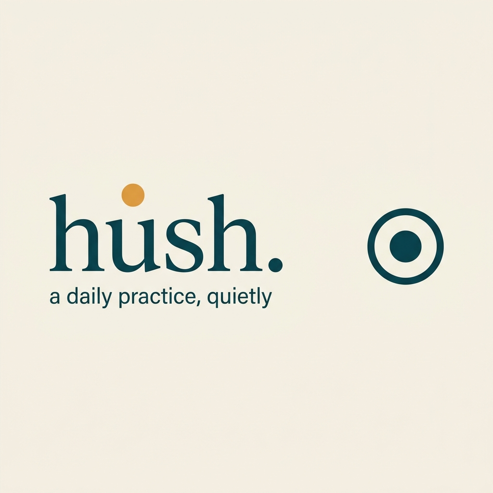

# hush.

> A daily practice, quietly.



**The mark:** the word `hush.` in a distinctive warm serif (DM Serif Display), set in cream on deep teal, with a single small muted amber dot above the `u`. The wordmark is the icon. The dot is the only symbol.

**Repo:** `albertlaudia/mx.pclub.hush`
**Org prefix:** `mx.pclub.*` (pclub product family)
**Sibling apps:** `mx.pclub.cadence` (the no-PBL counterpart), `mx.pclub.caloriecounter`, `mx.pclub.pulse`

---

## What this is

A **minimal, working daily-practice app** — the v0.2 vertical slice. The product is the practice. One verse, one moment of attention, one quiet "continue" tap. That's it.

**This is the deliberately-simpler sibling of `mx.pclub.cadence`.** Where Cadence ships a chapter mark, a Section, a composition, and an E2E-encrypted social layer, `hush.` ships **three screens and a settings page**. No streak counter. No home widget. No mood check-in. No notifications. No subscription. The minimal is the feature.

## The name

**`hush.`** — lowercase, with a period.

Hush means *to make quiet, to settle*. The product hushes the world for one verse. The user is hushing their day to attend. The verb is universal — works for any spiritual practice, any faith, any secular mindfulness routine.

Why this name and not the old `lock.`: "lock" implied *blocking* (your phone, your day, your distractions). The product is not a blocker. The product is a *hush* — a brief, settled quiet, a moment of attention, then you return to the day. The name matches the *state* the user enters, not the *action* we force on them.

## The mark


A wordmark in cream on deep teal, with a small amber dot above the `u`. A journal cover, not a streak counter.

The brand identity is **field-journal**, not prayer-app. It evokes a leather-bound notebook on a wooden desk, not a stained-glass window. The amber dot is the wax seal on the letter. The teal is the cloth cover.

## The platform — minimal v0.2

The MVP ships with **three screens and a settings page**:

| Screen | What it does |
|---|---|
| **Onboarding** | A single screen. Pick a practice window (morning / midday / evening / anytime). One button. |
| **Home** | "good morning." Today's practice — the reference, a 6-word preview, a "what is this?" link, a "begin" button. After completion, the home says "see you tomorrow." with the practiced reference. |
| **Practice** | An 800ms breathing space, then the verse fades in over 400ms. A "continue" button (not "done"). One light haptic on tap. "see you tomorrow" + 1500ms. |
| **Settings** | Practice window, today status, "what is this?" link, "about hush." (version, made-by, open source licenses), reset. |

That's the entire product.

## What this is NOT

- **Not** a streak counter. No flame. No "Day 47!". No "best ever".
- **Not** a mood check-in. No "how are you feeling today?" slider.
- **Not** a public widget. No home screen broadcast.
- **Not** a cross-app blocker. No AccessibilityService. No iOS FamilyControls.
- **Not** a notification engine. No daily reminder. (Yet.)
- **Not** a social product. No Section. No leaderboard. No "share my streak".
- **Not** a subscription. No paywall. No "PRO" tier. No "Restore your streak for $4.99".
- **Not** a multi-locale product. English only. Add locales via `flutter_localizations` + `intl` ARB files.
- **Not** a clone of anything. The mark, the colors, the copy, the UX — all genuinely ours. See `docs/BRAND.md` for the design tokens and `docs/VS-CADENCE.md` for the side-by-side with Cadence.

## The brand

- **Wordmark:** `hush.` in DM Serif Display, cream on deep teal
- **Secondary mark:** a small dot inside a thin ring (for small contexts)
- **Palette:** deep teal `#1F3D3A`, warm cream `#F5F0E6`, muted amber `#B89968`, ink `#1A1A1A`
- **Type:** DM Serif Display (display) + Inter (body)
- **Voice:** lowercase, no exclamation marks, no superlatives, no guilt copy
- **Detail in `docs/BRAND.md`**

The brand is not the Prayer Lock orange + padlock + cross. It is a journal cover. See `docs/BRAND.md` for what was explicitly rejected.

## Marketing & brand assets

All marketing materials live in [`media/`](media/README.md) — the single source of truth. Every platform (iOS, Android, web, social) draws from here:

- **App icon set** — 15 iOS sizes, 5 Android mipmap densities, 4 favicon sizes
- **Wordmark masters** — `primary-1024.png` (wordmark on teal), `secondary-1024.png` (dot-in-ring on teal)
- **Social media** — `social-preview-1280x640.png` (GitHub), `opengraph-1200x630.png` (OG), `banner-twitter-1500x500.png`, `banner-linkedin-1584x396.png`
- **Marketing** — `hero-1920x1080.png` (README hero), `poster-1080x1920.png` (vertical), `logo-lockup-1500x1000.png` (press kit), `brand-colors-1500x1000.png` (palette)

To regenerate every derivative from a new wordmark master: `python3 scripts/resize-icons.py`.

## Stack

- **Flutter 3.27+** — single codebase, iOS + Android from the same `lib/`
- **Riverpod 2.5+** — state management
- **shared_preferences 2.3+** — local persistence
- **google_fonts 6+** — DM Serif Display + Inter
- **intl 0.19+** — date formatting

No backend. No Firebase. No notifications. No E2E encryption. The product is local-only.

## Repo layout

```
mx.pclub.hush/
├── lib/                       Dart source
│   ├── main.dart              entry, gate, ProviderScope, HushApp
│   ├── core/
│   │   ├── theme/             AppTheme (teal/cream/amber) + BrandMark
│   │   ├── storage/           PracticeState + Riverpod provider
│   │   ├── ui/                WhatIsThisSheet, versePreviewText
│   │   └── utils/             date math + curated verse pool
│   └── features/
│       ├── onboarding/        1-screen first-launch
│       ├── home/              today's practice card (active + practiced)
│       ├── practice/          the moment — full-screen verse with 800ms breathing
│       └── settings/          window, today, what is this?, about hush., reset
├── assets/verses/verses.json  12 curated public-domain verses
├── ios/                       iOS Runner target
│   ├── Runner/                AppDelegate, SceneDelegate, Info.plist
│   └── Runner.xcodeproj/      PRODUCT_BUNDLE_IDENTIFIER = mx.pclub.hush
├── android/                   Android target
│   ├── app/src/main/kotlin/mx/pclub/hush/   MainActivity.kt
│   └── app/src/main/res/      strings.xml, mipmap-*
├── media/                     brand mark, full icon set, marketing assets
│   ├── icons/                 iOS + Android + favicons + masters
│   └── *.png                  hero, social, poster, banner, lockup, palette
├── scripts/                   resize-icons.py
├── docs/                      BRAND.md, VS-CADENCE.md, PRODUCTION-READINESS.md
├── test/                      16 widget + unit tests
└── README.md
```

## How to run

```bash
flutter pub get
cd ios && pod install && cd ..
flutter run -d <device>
```

## What's planned for v0.3 (the "better platform")

The minimal v0.2 is the floor. Once 5-10 internal users have lived with it for 14 days, we add:

- **A quiet day-count** (our way, not the PBL way — no flame, no public score, no shame)
- **A home screen widget** (the secondary mark + day count)
- **A daily notification** at the user's chosen window
- **Multi-locale** (8 locales, three-layer parity, no surprise languages)
- **Settings depth** (custom cadence, locale, sign out)

These are added *after* the minimal is validated, not before. The minimal is the feature.

## Why this exists

This is the **deliberately-simpler sibling of `mx.pclub.cadence`**. Where Cadence ships the philosophy of "no PBL, no streaks, no gamification", `hush.` ships the practice, full stop. Same Flutter + Riverpod base. Same `mx.pclub.*` repo convention. Different product scope.

If you ship both, you A/B-test the philosophy in the market. If you ship `hush.` alone, you bet that the practice is the feature and the score is the noise. Read `docs/VS-CADENCE.md` for the full side-by-side.

## License

Documentation: MIT. See `LICENSE`.
Product code: closed-source, all rights reserved.

---

🔗 **https://github.com/albertlaudia/mx.pclub.hush**
